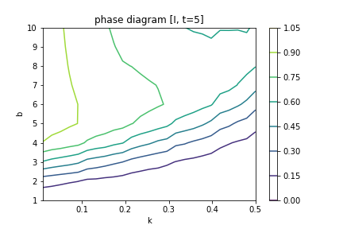
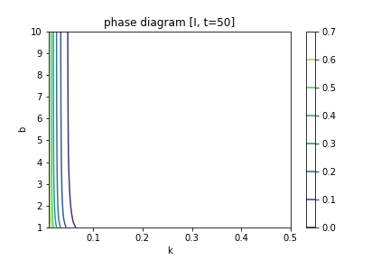
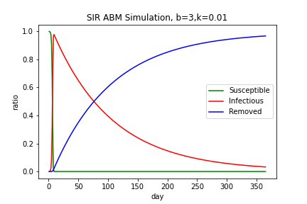
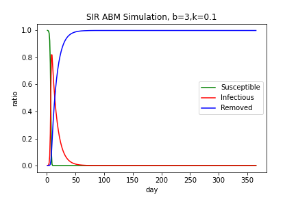
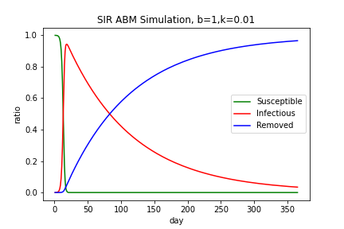

# Agent-Based and Ordinary Differential Equation Modelling of SIR Model

## 1. Introduction to the SIR Model
The SIR model is a compartmental epidemiological model which assumes everyone in a population falls into one of three compartments: Susceptible, Infectious, and Recovered (sometimes referred to instead as Removed). The Susceptible population consists of those who have not yet gotten the virus and thus are _susceptible_ to becoming infected. Infectious individuals are those who carry the virus and are capable of infecting others for some period of time before eventually transitioning into the Removed group. Lastly, Removed individuals are those who are no longer part of the system because they have either acquired immunity or died from the disease. 

The trajectory of the disease generally depends on the parameters `b`, the per capita number of interactions capable of spreading the disease that occur per day, and `k`, the rate at which Infected individuals move into the Removed compartment. Notably, the basic SIR model assumes that all agents in the population interact randomly so every Susceptible individual shares an equal chance of becoming infected in each period. I.e. the probability for any given Susceptible individual to become infected in a period is `b * I/N`. Additionally, `k` can be interpreted as the reciprocal of the mean duration of infection when duration of infections are exponentially distributed (1). For Covid-19, no conclusive figure has been established as the mean duration of infection. However, the US CDC estimates that the majority of cases become no longer infectious within 10 days, though some serious cases can remain infectious for up to 20 days (2). 

From the dicussion above, we can note that for any period, we can predict if the infection will continue to spread or being to decrease in the next period. Since the (expected) number of new infections can be given by `S * b * I/N` and the (expected) number of removals is given by `k * I`, if the ratio of the two, `(S * b) / (k*N) > 1` then the infection will continue to spread since the number of new infections outpaces the number of recoveries; whereas if `(S * b) / k*N) < 1`, the number of recoveries exceed te number of infections and so the infection will begin to die out on its own. Within epidemiolgy, this relationship is commonly known as the 'effective reproduction number' (3).

## 2. Structure of the `sir` Package
This version of the `sir` package contains implementations of classes that facilitate analysing the trajectory of Covid-19 using the SIR model. The `sir` folder currently contains a module for agent-based modeling, `abm`, as well as a module for modeling as a system of ordinary differential equations, `ode`. 

The `test` folder contains the script `test.py` which can be run using `unittest` or `pytest` to verify the integrity of the `abm` and `ode` modules. The test is also continuously integrated using GitHub Actions. 

Scripts used for generating the phase diagrams and simulation results presented later in this report are held in the `scripts` folder. Note that the functions used to generate the figures is actually implemented within the `sir` module and the scripts simply specify initial conditions and call the methods from the module.

The `doc` folder which contains the `checkpoint` subfolder which contains this report also contains the `final` subfolder which is where the report that accompanies the final implementation of this module will be contained.

The `LICENSE`, `requirements`, and `setup` files are contained in the main directory so as to facilitate easy installation and use of this package.

## 3. Results
In our phase diagrams, we can see that higher values of `b` will lead to higher rates of population infection for any rate of removal `k` at low t-values. Once we start evaluating population rates at higher values of `t` (see t=10), we see that the highest rates of infected population come with more middling values of `b`. High `b` values will spread the disease faster, but will also lead to a faster removal rate. Thus, the way a disease maintains a steady infected population through higher `t` values is with a more meager spreading rate `b`.

Additionally, our phase diagrams show us a few differences between the AMB and ODE model. The ABM (discrete) is based on random interaction between a population of agents. This randomness leads to heavy volatility in the ratios of Susceptible/Infected/Removed that is not present in the purity of the ODE (continuous) model's mathematical solution. Futher, the ODE model has synchronous removal and infection rates, while the ABM treats these two as asynchronous actions -- only removing a proportion of the infected population after the disease has been spread further for that day.
These two factors lead the discrete model to output much more jagged phase plots than the smooth ODE counterparts. However, as `t` increases, the volatility of ABM flattens out and the phase plots begin to agree/converge to the ODE's mathematical solutions.

### 3.1 Phase Diagrams
Ordinary Differential Equation Model (Continuous Model) | Agent-Based Model (Discrete Model) 
-|-
 | 
 | 
 | 

The only way for a simulation to reach a completely infected populace is to have a removal proportion (`k`) of 0. Otherwise, we see that higher rates of `k` deteriorate the infected population faster and faster. 

Also, we can see that for low _t_, the contour lines show that as `b` approaches certain levels, it requires very large increases in `k` to prevent the infection rate from skyrocketing. But, as `b` gets very large (beyond the level that causes a spike), the level of `k` required actually begins to decrease. This results from the fact that the phase diagrams fix the time, `t`, and so if `b` is too high, and the infection lasts for a relatively short time, then many infections will resolve before `t`. Meanwhile, if `b` is relatively small, then even small increases in `b` will cause the number of cases at time `t` to increase a lot if the recovery time, `k` is relatively longer.

### 3.2 Time Plots of S, I, R
ODE (Continuous Model)| Agent-Based Model (Discrete Model)
-|- 
 | 
 | 
 | 

Here, we can see that as expected, the ODE and ABM models generate very similar plots. This confirms that the ODE SIR model does a very good job of approximating the "real" situation which is modeled more literally by the ABM. This is good news because the ODE version of the model is noticeably faster than the ABM model. So, we can use the ODE model to give us the same results as what we would expect from an ABM model for large populations with a much faster computation time. The ODE model also offers the additional advantage of being able to specify non-integer values of `b`. 

## 4. Possible Extensions/ Variations
### 4.1 Allow for different rates of interaction between certain individuals
#### Motivation
This could apply to situations such as within-household transmission versus across-household transmission. The aim of this extension would be to relax the assumption that all members of a population interact with each other at a constant rate. It is easy to imagine that the rate of interaction between family members or neighbors tends to be much higher than the rate of interaction between strangers.

A hypothesis that could be tested is that even with very little social interaction with strangers ("outside interaction"), Covid could propagate quickly and widely if within-household interaction ("local interaction") remains relatively high. By simulating a Covid trajectory with both local and outside interaction, and then plotting a phase plane, we could see how the different types of interaction contribute to Covid spread.

Another hypothesis is that differences in social structures will cause some individuals to be much more likely to be infected than others. This can be tested by running the simulation and examining the resulting pattern of infection (i.e. who is and isn't infected) after a given time period. More on this is explained in the following subsection.

#### Changes to the Model
An agent-based model of this could incorporate something similar to the 'game of life' previously examined in this course. That is, we assume all individuals live on a grid and we create 'neighbors' for each individual with whom the individual has a relatively high proabability of meeting every day. Meanwhile, the individual meets non-neighbors at a much lower probability every day. Again, we would assume that interaction with an infected individual causes susceptible individuals to become infected and they do not quarantine upon infection but gain immunity following infection. Based on the hypothesis above, we would expect to see that individuals closer to the center of the grid have a higher probability of being infected because they are, on average, closer in terms of number of degrees of social separation to every other individual than those closer to the edges of the grid. Ideally, a visualization of a sparse matrix could be generated to see this. Or, we could run the simulation multiple times and count the number of times each individual was infected and create a "heatmap" of infection probabilities.

A potentially similar change that could be implemented as a system of ODEs would be to assume that there are a finite number of groups or categories of people, which each has a different level of susceptibility and model accordingly. This would be the Differential Susceptibility SIR (DS-SIR) model (1). The resulting system of differential equations would be represented by the following diagram from (1). In this case, we could check several variations of distributions of susceptibilities that all have the same overall average susceptibility/ transmission rate and see how or if the trajectory of the disease changes.

#### Data
This exercise is primarily simulation-focused. However, if we want to attempt to test the model against real-world data, we could use data from Alberta, Canada. Alberta recently implemented a controversial "cohort system" of Covid-19 control in which each individual is allowed to have a "core cohort" within which they have relatively broad freedom to interact but must otherwise maintain social distancing when in public (2). Data on Alberta's Covid-19 cases is freely available online (3). This data could be used to help estimate sensible parameters and/or test the predictive power of the expanded model.

#### Specific References
1. Ma, Z., \& Li, J. (2009). Basic Knowledge and Modeling on Epidemic Dynamics. In Dynamical Modeling and Analysis of Epidemics (pp. 1-82). Singapore: World Scientific.
2. https://www.alberta.ca/restrictions-on-gatherings.aspx
3. https://www.alberta.ca/stats/covid-19-alberta-statistics.htm 

### 4.2 Use agent-based modelling to show the effect of (incomplete) mask usage
#### Motivation
Although there is broad agreement that travel restrictions and social distancing are beneficial to limit the spreading of covid-19, recommendations around face mask use are inconsistent. Some countries advise to wear face masks while others do not. Further, in the United States, different states have different policies. Therefore we want to investigate and show the effect of different extents of face mask usage. What is the relationship between the proportion of mask users and the spread of Covid-19? I.e. Is it linear or non-linear? Are there any positive or negative externalities that affect either type that results? Will wearing face masks limit the spreading trend or will it even reduce the final infection proportion of the population? Can face mask usage delay the peak time of the epidemic?

#### Changes to the Model
Suppose agents are separated into two 'types': those who wear masks and those who do not. Wearing a mask reduces the risk of spreading Covid-19 (conditional on being Infected) by xx% and reduces the risk of becoming Infected (conditional on being Susceptible and coming into contact with an Infected) by yy%. 

In discrete methods, we can define a new status `m_status=True` or `m_status=False` and incorporate it into the function which simulates the spread process (`infect_pop` function in abm.py). 
For each `agent i`, when `agent i` is the virus spreader, the new spread parameter `b[i]` should be `xx% * b[i]`, and when `agent i` is the virus receiver, it have `yy%` probability to become infected. 
Briefly speaking, when an agent decides to wear a mask, it will spread or receive the covid virus at a lower probability. 
In addition, the patient recovery process does not change, so we would not need to change parameter `k`.

According to the reference paper, we can manipulate many variables. We can determine what proportion of the population wears a mask, and if this proportion changes over time or is different for different sub-populations. We can also manipulate the effectiveness of face masks (our `xx%` and `yy%`) in stopping the spread of disease.

#### Data
This exercise is primarily simulation-focused. In practice we don't have definite information on the effect and usage of facemasks -- different masks have varying protection levels, and the relationship between demographic features and the mask coverage rate is not obvious. What we do have access to are the results of a survey conducted by New York Times in the summer of 2020 that reports county-level mask usage. This data may provide inspiration for some of the simulations we run.

#### Specific References
1. Worby, C.J., Chang, HH. Face mask use in the general population and optimal resource allocation during the COVID-19 pandemic. Nat Commun 11, 4049 (2020). https://doi.org/10.1038/s41467-020-17922-x
2. https://github.com/nytimes/covid-19-data

### 4.3 Adding a compartment for "Exposed" individuals, turning the model into the SEIR model
#### Motivation
Suppose there is a policy for individuals to voluntarily quarantine themselves if they believe they have been exposed to the virus. Then suppose being in quarantine reduces the number of interactions these individuals have for the extent of their quarantine.
When considering this model, we want to investigate several questions.
Would making the rate at which individuals enter the Exposed category a function of Covid-19 cases simulate the several waves of the virus that we are experiencing? 
Is this policy really useful in terms of controlling the pandemic? Does it reduce total infection and/or reduce total death? How potent are other potential benefits such as reducing hospital loads?
If this policy is proved effective to control the pandemic, what is the best length of quarantine (tradeoff of cost and benefit)?

#### Changes to the Model
For continuous ordinary differential equation, we can change the equations to below(4).

We have `S + E + I + R = N`, Lambda is birth rate, mu is death rate. So by changing RHS function, we can implement this extension.

For discrete Agent Based Modeling, by adding a new status `E` and some operation functions, we can implement this extension.

#### Data
This variation is also simulation-focused. Potentially, we could try to use data on the number of Covid-19 cases in the US at the county-level(2) and phase diagrams to investigate what combinations of parameters could have led to their observed trajectory.

#### Specific References
1. https://en.wikipedia.org/wiki/Compartmental_models_in_epidemiology#Variations_on_the_basic_SIR_model
2. https://github.com/nytimes/covid-19-data 

### 4.4 Assume immunity is temporary and model the effects of a vaccine that takes time to roll out/ is not universally adopted
#### motivation
For a long time, people have hoped for a virus endgame to the current pandemic. In this extension we hope to model the pandemic trend with the vaccine being continuously produced and distributed. 
Assume a vaccine comes out that grants temporary immunity to Covid-19. Further assume that only a relatively small portion of the population is able to gain access to the vaccine in each time period. 
How will the overall trajectory of Covid-19 look? Is there a minimum threshold for speed/extent of vaccine adoption in order for it to be effective?

#### Changes to the model
This extension is similar to our extension on the effectiveness of mask wearing. When a person takes the vaccine, they will not be infected for a while and will not spread the virus. This is the same with absolutely effective masks. 
When the effect of the vaccine disappears, that person will lose their immunity, just like someone who stops wearing their fully effective mask. 

For this variation, building an Agent Based Model is easy. We can modify the mask extension a bit by adding a time recorder for each person. When the person receives vaccine, his/her `m_status` turns to TRUE, and initializes the the time recorder to be 0. 
At every step `t` we will iterate their time recorder. If it is larger than the threshold, we will then turn the `m_status` to a FALSE state. 
It is more difficult to model this situation explicitly using ODE. The situation could potentially be approximated using the DS-SIR model mentioned in a previous extension. 

#### Data
This exercise is simulation-focused. Data is inaccessible especially because no publicly available vaccine currently exists yet.

## 5. References:
1. Martcheva, M. (2015). An introduction to mathematical epidemiology. Heidelberg, New York: Springer. doi:10.1007/978-1-4899-7612-3
2. Clinical Questions about COVID-19: Questions and Answers. (n.d.). Retrieved November 09, 2020, from https://www.cdc.gov/coronavirus/2019-ncov/hcp/faq.html
3. Rodpothong, P., \& Auewarakul, P. (2012). Viral evolution and transmission effectiveness. World Journal of Virology, 1(5), 131. doi:10.5501/wjv.v1.i5.131
4. https://en.wikipedia.org/wiki/Compartmental_models_in_epidemiology#Variations_on_the_basic_SIR_model
