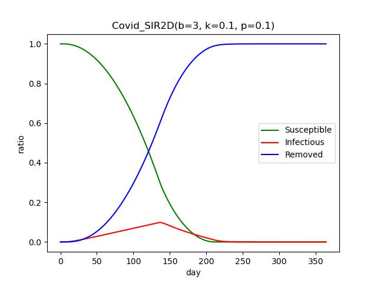
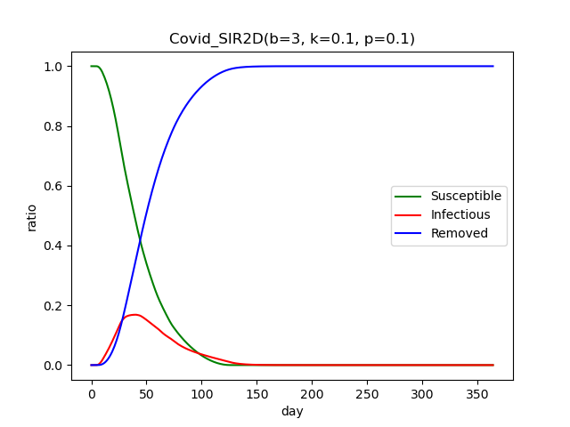

# Agent-Based and Ordinary Differential Equation Modelling of SIR Model -- With Extended Functionality

## Abstract

## 1. Introduction to the SIR Model
The SIR model is a compartmental epidemiological model which assumes everyone in a population falls into one of three compartments: Susceptible, Infectious, and Recovered (sometimes referred to instead as Removed). The Susceptible population consists of those who have not yet gotten the virus and thus are _susceptible_ to becoming infected. Infectious individuals are those who carry the virus and are capable of infecting others for some period of time before eventually transitioning into the Removed group. Lastly, Removed individuals are those who are no longer part of the system because they have either acquired immunity or died from the disease. 

The trajectory of the disease generally depends on the parameters `b`, the per capita number of interactions capable of spreading the disease that occur per day, and `k`, the rate at which Infected individuals move into the Removed compartment. Notably, the basic SIR model assumes that all agents in the population interact randomly so every Susceptible individual shares an equal chance of becoming infected in each period. I.e. the probability for any given Susceptible individual to become infected in a period is `b * I/N`. Additionally, `k` can be interpreted as the reciprocal of the mean duration of infection when duration of infections are exponentially distributed (1). For Covid-19, no conclusive figure has been established as the mean duration of infection. However, the US CDC estimates that the majority of cases become no longer infectious within 10 days, though some serious cases can remain infectious for up to 20 days (2). 

From the dicussion above, we can note that for any period, we can predict if the infection will continue to spread or being to decrease in the next period. Since the (expected) number of new infections can be given by `S * b * I/N` and the (expected) number of removals is given by `k * I`, if the ratio of the two, `(S * b) / (k*N) > 1` then the infection will continue to spread since the number of new infections outpaces the number of recoveries; whereas if `(S * b) / k*N) < 1`, the number of recoveries exceed te number of infections and so the infection will begin to die out on its own. Within epidemiolgy, this relationship is commonly known as the 'effective reproduction number' (3).

## 2. Spatial SIR Model

### The Spatial PDE Model
Firstly, let's look at the spatial SIR model implemented by updating our ODE model to a similar PDE model. The system of PDEs is:

    \partial s(x, t)/ \partial t = -b * s(x, t) * i(x, t) + p * L * s(x, t)
    \partial r(x, t)/ \partial t = k * i(x, t) + p * L * r(x, t)
    \partial i(x, t)/ \partial t = b * s(x, t) * i(x, t) - k * i(x, t) + p * L * i(x, t)

Here we have a new parameter `p` which is to weight the diffusion term. A larger `p` means each compartment diffuse quickly in space. 

Set `b=3`,`k=0.1` test different p values.

p=0.02|p=0.1|p=1|p=10
-|-|-|-
|||

From above plots, we can find that recovered population of all plots approximate to 100% when t goes large. 
This means for different `p` all population will be infected at last. 
However, the ratio of total infected population (recovered and infectious compartments) grows up at different speed. 
When p is large, the trajectory of spatial SIR model is similar to SIR model. 
This is because large p means a person can interact with more people, 
so when p is large enough the trajectory of spatial SIR model would be very similar to that of a non-spatial SIR model.

Therefore choosing a relative small p will be interesting for spatial SIR model. I select `p=0.1`
By setting i(x,0) appropriately, we can investigate the location effect of initial infected individuals.

- set i((0,0), 0) to be nonzero but other i to be zeros, we can simulate diseases spreading started in a single corner of the square.
- set i((M/2,M/2), 0) to be nonzero but other i to be zeros, we can simulate diseases spreading started in the center of the square.
- randomly select several points of i to be nonzero but other i to be zeros, we can simulate random spread out situation.

corner|center|random
-|-|-
||

From the figures above, we can find that

- if the disease start at a corner of the square, it will take a longer time for the disease to spread out. The ratio of illness population at one time will be small or the curve be "smoothed". This `square world` will a longer time to prepare.
- if the disease start at the center of the square, it will take a middle time for the disease to spread out and the the curve is higher than the corner one. 
- if the disease start at some random points of the square, this is fastest situation.

### The Spatial Agent-Based Model
In addition to our PDE model, we also implemented a spatial component into our existing agent-based simulations. Upon initialization, agents in our spatial simulations were given two dimensional coordinates to designate their starting position contained within the unit square.

The daily steps of the simulation remain largely the same, with a specified proportion (`k`) of those infected being removed with the remaining infected interacting, and possibly infecting, the rest of the populace. Rather than designating a set number of interactions for the infected, each agent in the spatial simulation will move once in a random direction each day and interact with whichever agents happen to be where they end up in the unit square. Infected agents will infect whoever they reach and susceptible agents will get infected if they end up near a diseased agent. Recovered agents will not move at all as they cannot influence any part of the simulation in that state.

Daily movements will be scaled by a new parameter (`p`) and their net of interactions will be determined by the circle with radius `q` which will effectively replace our previous parameter `b`. Any daily movements that would see the agent exceed the bounds of the unit square will have them instead remain in the same location for the day.

Based on the earlier SIR model, we've elected to choose `k` = 0.1 and `q` $\approx$ 0.02 to determine the effect of `p` on simulations. The latter was determined based on the below rough relationship with `b`

 $q = \sqrt(\frac{b}{(N * \pi)}$

The below simulations started with an infection in the center of the unit square.

p=0.02|p=0.10|p=0.40|p=0.75
-|-|-|-
|||

Similar to our PDE model, we see that no value of `p` is completely preventative of forever delaying a completely infected populace. However, we can note a few differences in the agent-based simulation's relationship with `p`.

Our slowest growing diseases come from our lowest and highest values of `p`. This comes from the infected simply making very meagre progress across the unit square, or from making such large moves that they exceed the boundaries of the square and do not end up moving. A middle ground sees infected able to cover large parts of the unit square without often stepping out of bounds.

To identify the relationship between our spatial component and the duration of our epidemic, we then can look at different simulations where the infection starts in a Corner, the Center, or at random points across the unit square. For a more moderate virus expansion, we've selected a step size of `p` = 0.02.

corner|center|random
-|-|-
||

The agent-based figures largely compare well to the PDE counterparts:

- Corner-based diseases are the slowest to perpetuate across the unit square. Even with a small step size, infected agents are very likely to overstep the two edges they start next to which could greatly impede disease progress.
- Center-based diseases are faster, simply as they are unlikely to overstep any edges of the square at such a low step size. However, having all of the infected start in one location delays the spread a little bit.
- Randomly initialized diseases have the easiest time spreading as the infection can start in different `communities` of the square from the beginning.

## 3. Extensions to the SIR Model

### Allowing for Different Rates of Local and Non-Local Interactions

One major procedure for stemming the spread of an epidemic virus is to cut out all unnecessary close contact with infrequent social circles. Part of the province of Alberta's COVID-19 Relaunch guidelines was the insistence that social interactions without the proper safety measures (eg mask wearing and social distancing) to be limited to a core cohort of individuals. This kind of group often is established as a household or an extended household. Done effectively, a cohort helps insulate your social circle from the virus, and helps contain the virus within your social circle if someone within is infected.

Our initial agent-based model considered interactions to occur randomly across the populace. For this extension, we will instead be considering all `b` interactions to occur within an agent's cohort. The last of these `b` interactions will have a chance to occur outside the cohort, or non-locally. We will label this outside `b` chance as the parameter `ob`.

To loosely identify cohorts, our agent population will be assembled into an two-dimensional, N x N, grid. The fellow agents immediately surrounding an agent will be considered its local interaction candidates. For most agents this will be a group of 8, whereas for the agents on the edge of the grid this could be as low as 3. The simulation will occur in the same format as our vanilla SIR ABM, but with the `b` interactions affecting only direct neighbors, with the aformentioned chance `ob` that an interaction occurs with a non-neighbor.

With the below phase diagram, we can see how our disease spread changes based on the value of `ob`. To judge it in comparison to our initial SIR model, we'll use the consistent parameters `b`=3 and `k`=0.1.

-Largely, the implementation of cohorts to the model dulls the spread of the virus. Most simulations do not reach high levels of infection until day 35.
-Higher values of `ob` lead to faster rates of infection more in line with the spread we saw in our vanilla SIR model.
-Even in spite of cohorts, we still eventually the infection hitting the population heavily within 50 days.

In addition to seeing how the cohorts affect the spread as a whole, we can also gauge how it affects certain agents differently. Below we have run a hundred simulations with cohorts in place to determine which individuals are likeliest to be infected.

-From this plot we can see that the most susceptible agents lie in the central band of our population grid. These individuals have the same number of agents in their direct cohort, but are also closer to every other cohort on the grid than the majority of other agents.
-Contrarily, those on the edge of the grid have more degrees of social separation than the average agent, and thus have the lowest chance of infection.

The issue with using direct neighbors as a cohort is that only implements loose cohorts. It is somewhat helpful in stemming the disease spread, but if everyone in an agent's cohort is also part of separate cohorts, there exists a maneuverable path for the disease to spread between any two agents. Part of the province of Alberta's stricter guidelines was to insist that citizens participate in one single core cohort. That is, the same people should be in a singular small group. This distinction separates cohorts that consist of households to those that consist of households and additionals.

To model a stricter variation of cohorts, we instead assigned every agent in our population to a group of 9 individuals. Now instead of local interactions occurring with their neighbors, it occurs with their neighbors that have the same cohort. 

If we look at a similar phase diagram for `ob` with this change, we can observe the following:

-The non-local interaction chance becomes drastically more important in producing high levels of infection. When `ob` is low, infection does not get high in the first 50 days.
-This stricter cohort enforcement is far more effective than the looser guidelines initially provided.

To further identify the background of this change in infection rate, we can look at a similar heatmap of infection rates from another hundred simulations:

-This map is a lot less smooth as infections that occur happen and stick within a certain cohort block.
-In general, very few cohorts hit any concering rate of infection
-Anytime a cohort member does get infected, the rest of the 9 members generally follow suit.

### Incorporate Interventions
For ODE model, use the most general model.

Q is not a new compartment, it only means `q` percent of `I` will not spread the virus, because they quarantine themselves.

    [maternally_derived_immunity-susceptible-exposed-infectious-quarantine-recovered-decreased]
    dm / dt = lam - sigma * m - mu * m
    ds / dt = sigama * m + re * r - mu * s - b * s * (1-q)i
    de / dt = b * s * (1-q)i - (mu + a) * e
    di / dt = a * e - (k + mu) * i - d * log(i/1-i)
    dd / dt = d * log(i/1-i)
    dr / dt = k * i - (mu +re) * r

If the society does not take any action, the trajectory will look like this. Parameters are set to be

(lam=3e-05, sigma=1/720, b=3, k=1/10, q=0, a=1/14, mu=3e-05, dr=0.3, re=1/360)

By define some events functions, we can implement ODE with interventions. We will compare with the figure above with the trajectory of interventions.
    
#### mask

For ODE model, wearing a mask will decrease `b` of the model. Therefore, we define a event when `i=0.05`, people are asked to wear masks and fortunately most people follow this advice `b` change from 3 to 0.1 .

wearing a mask|no intervention
-|-
| 

the dashed line shows when people follow this advice, before and after the dashed line shows the effect of the intervention of wearing a mask.
Compare two plots, we can find that wearing a mask significantly reduce the ratio of disease caused death population. Most people will not suffer the pain of illness and remain to be susceptible. 

#### vaccine

#### quarantine

For ODE model, quarantine will limit `I`'s movement, reduce the interaction of `S` and `I`. Here we define two events, when `i=0.05`, `q=0.8`, when `i=0.1`, `q=0.99`.

suggest quarantine | no intervention
-|-
 | 

From above plots, we can find that by taking interventions total death population reduced significantly. 

### Additional Compartments by ODE method
In this part we extend SIR model to various other ODE models and have a look at the plot of those models.
For detailed model description please check in appendices. Here we only show the result.

|
|
|
|
|

## 3. Discussion and Conclusion

## 4. Bibliography
